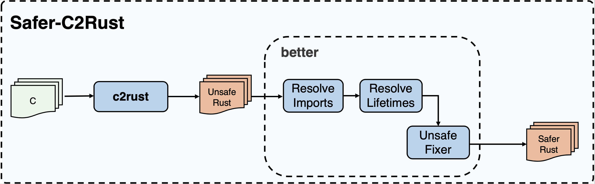

# Safer-C2rust

## 一、介绍

本项目将在[c2rust](https://github.com/immunant/c2rust)已有工作的基础之上，实现一个可将不安全的Rust代码转换为更安全的Rust代码的原型系统，该系统可删除重复的类型定义，移除部分不必要的unsafe标记，并将部分裸指针转换为安全引用。

## 二、软件架构



本系统原型由三部分组成：

+ **翻译前端 - c2rust**

  将c2rust作为本系统原型的**翻译前端**，进行C到Rust的翻译；将得到的翻译结果作为**优化工具better**的输入。

+ **优化工具 - safer**

  对c2rust翻译得到的初始版本的Rust代码进行优化，主要分为三个优化模块：**Imports Resolver**、**Lifetime Resolver**和**Unsafe Fixer**，进行重复类型定义的去除和安全性的提升。

+ **统计工具 - stat**

+ 项目结构

  ```
  c2rust/
   + docs/           -- 项目文档
   + exmamples/      -- 测试例
   + safe-analyzer/  -- 安全指标分析工具
   + scripts/        -- 辅助脚本，包括三个优化模块的默认前处理脚本
   + src/            -- 项目源代码文件
   + results/        -- （运行创建）结果数据，可由config.toml定义
   + bin/            -- （运行创建）编译后的可执行文件，可由config.toml定义
   + logs/           -- （运行创建）日志文件
   - build.py        -- 自动构建脚本
   - run.py          -- 运行入口脚本
   - config.toml     -- 项目配置文件
   - pyproject.toml  -- python环境配置文件

+ 项目结构

  ```
       C Program 
          |
          |  C2Rust（翻译前端）
          V
       Unsafe rust program：重复类型定义 + extern + unsafe 
          |
          |  ResolveImports （优化工具better）
          V
        Unsafe rust program：已去除重复类型定义，消除非必要的extern，使用use引入，消除非必要的unsafe
          |
          |  ResolveLifetimes （优化工具better）
          V
        unsafe rust program: unsafe范围过大
          |
          |  unsafe-fixer （优化工具unsafe-fixer）
          V
        Safer rust program：去除重复类型定义，消除非必要的unsafe，改写部分裸指针
  ```

## 四、安装教程

1. 安装前置依赖
    + openEuler/CentOS

        ```shell
        sudo yum update
        sudo yum install git gcc gcc-c++ llvm llvm-devel clang clang-devel make cmake ninja-build openssl-devel pkgconfig python3
        ```

    + Ubuntu/Debian

        ```shell
        sudo apt-get update
        sudo apt-get install git build-essential llvm llvm-dev clang libclang-dev make cmake ninja-build libssl-dev pkg-config python3
        ```

2. 克隆项目仓库到本地

    ```shell
    git clone https://gitee.com/openeuler/c2rust.git
    ```

3. 安装`rust`

    ```shell
    curl --proto '=https' --tlsv1.2 -sSf https://sh.rustup.rs | sh
    ```

    ```shell
    source $HOME/.cargo/env
    ```

    > 注：如因网络问题失败，可尝试更换国内源

4. 将本地rust的lib加入`LD_LIBRARY_PATH`环境变量，文件夹位于`$HOME/.rustup/toolchains/nightly-2021-11-22-<PLATFORM>-<OS>/lib`与`$HOME/.rustup/toolchains/nightly-2021-11-22-<PLATFORM>-<OS>/lib/rustlib/<PLATFORM>-<OS>/lib`内，其中`<PLATFORM>`与`<OS>`依赖于具体的架构与操作系统：

+ 如在操作系统为`openEuler`、架构为`arm64`的情况下，运行：

    ```shell
    echo 'export LD_LIBRARY_PATH="$HOME/.rustup/toolchains/nightly-2021-11-22-aarch64-unknown-linux-gnu/lib/":$LD_LIBRARY_PATH' >> ~/.bashrc
    ```

    ```shell
    echo 'export LD_LIBRARY_PATH="$HOME/.rustup/toolchains/nightly-2021-11-22-aarch64-unknown-linux-gnu/lib/rustlib/aarch64-unknown-linux-gnu/lib/":$LD_LIBRARY_PATH' >> ~/.bashrc
    ```

+ 如在操作系统为`Ubuntu`、架构为`x86_64`平台上，则运行：

    ```shell
    echo 'export LD_LIBRARY_PATH="$HOME/.rustup/toolchains/nightly-2021-11-22-x86_64-unknown-linux-gnu/lib/":$LD_LIBRARY_PATH' >> ~/.bashrc
    ```

    ```shell
    echo 'export LD_LIBRARY_PATH="$HOME/.rustup/toolchains/nightly-2021-11-22-x86_64-unknown-linux-gnu/lib/rustlib/x86_64-unknown-linux-gnu/lib/":$LD_LIBRARY_PATH' >> ~/.bashrc
    ```

  最后运行：

  ```shell
  source ~/.bashrc
  ```
    
5. 安装`safer-c2rust` 自动构建与运行的python环境，在项目目录下运行：

    ```shell
    pip3 install -e .
    ```

    > 注：如因网络问题失败，可尝试更换国内pip源

6. 运行自动构建脚本：

    ```shell
    python3 build.py -a
    ```

    > 注：过程中可能因为github访问、或cargo源的网络问题而失败，可以尝试更换网络或者cargo源再次运行

## 五、使用教程

`safer-c2rust`的运行入口是根目录中的`run.py`文件，运行命令

```shell
python3 run.py --help
```

可以获取脚本的使用方法，`run.py`脚本包括了三个子命令，分别是:

+ `c2rust`: 原生`c2rust`的命令接口
+ `safer`: `safer-c2rust`的命令接口
+ `stat`: 结果统计命令

可以通过在子命令后加入`--help`选项获取帮助信息，如：

```shell
python3 run.py safer --help
```

### 子命令链式调用

`run.py`的子命令可以链式调用或者单独使用，例如将`path/to/c_project`的C语言项目，直接转换为优化后的Rust项目，并获得优化统计结果，可以直接运行：

```shell
python3 run.py c2rust --local_path path/to/c_project safer stat
```

### 子命令单独调用

如果想使用`safer`子命令对已经使用`c2rust`工具转换的项目进行优化，需要这样运行：

```shell
python3 run.py -w path/to/result safer --project path/to/c2rust_result_project 
```

这条命令将已经使用原生`c2rust`工具转换的结果`path/to/c2rust_result_project`使用`safer`工具优化，并将最终结果存储在`path/to/result`文件夹中

### 从`osc`获取原始项目运行

通过设置项目名与`osc`分支名，可以直接远程获取C项目与默认编译选项，其中`osc`的的源地址可以在`config.toml`中进行配置，运行命令如下：

```shell
python3 run.py c2rust --src osc --project_name NAME --osc_branch BRANCH safer stat
```

### 使用自定义脚本进行`C2Rust`转换

默认情况下，`--mode`选项为`auto`，此时运行脚本会选择使用`cmake`或者`make`（默认）工具进行原生c2rust转换，但是用户可以通过将自定义脚本进行原生c2rust转换，通过将`--mode`设为`script`并使用`--script`指定一个shell或者python脚本运行。

```shell
python3 run.py c2rust --local_path path/to/c_project --mode script  --script FILE safer stat
```


### 项目结果

在没有指定`work_dir`的情况下，运行结果或生成在项目目录下的`results/<c_project_foldername>_<date>_<time>`文件夹中，其中包括以下文件：

-`P0_original`: 输入c项目的备份
-`P1_after_c2rust`: 经过原生c2rust转换之后的项目
-`P2_after_resolve_imports`: 经过**imports resolver**模块优化后的项目
-`P3_after_resolve_lifetime`: 经过**lifetime resolver**模块优化后的项目
-`P4_result`: 经过**unsafe fixer**模块优化后的最终结果
-`report_detail.json`: 优化后的各种指标的详细记录
-`report_summary.json`: 优化后指标的统计结果

### 选项说明

+ `-w, --work_dir`: 工具的工作文件夹，默认情况下，会生成在`./results/<project-name>_<datetime>`文件中

#### `c2rust`子命令选项

+ `-s, --src`: 该选项的值可以为`local`（默认）或者`osc`，为`local`时需要`--local_path`指定C项目文件夹，为`osc`时，需要`--project_name`指定项目名称与`--osc_branch`指定`osc`分支名称
+ `--local_path`: 指定C项目文件夹
+ `--project_name`: 指定`osc`上的项目名称
+ `--osc_branch`: 指定`osc`分支名称，默认为：openEuler-22.03-LTS-SP1
+ `--mode`: 该选项的值可以为`auto`（默认）或者`script`，选择`auto`的情况下将获取`--gencc`的值自动进行`c2rust`转换，而如果选择`script`，则执行`--script`的脚本进行转换
+ `--gencc`: 该选项的值可以为`cmake`或者`makefile`（默认），这里将决定该用什么工具生成`compile_commands.json`文件
+ `--script`: 如果`--mode`的值为`script`，那么程序将执行这里给出的`shell`或者`python`脚本进行转换，需要注意的是，转换脚本必须接收且只接收两个参数，第一个为需要转换c项目地址，第二个为输出地址。

#### `safer`子命令，包括以下子选项

+ `--project`: 如果要单独调用`safer`子命令，该选项可以设置safer工具进行优化的目标，通常为c2rust转换后的结果，
+ `--is_resolve_imports`: 是否使用imports-resolver模块进行优化，默认为`True`；
+ `--is_resolve_lifetime`: 同`--is_resolve_imports`；
+ `--is_fix_unsafe`: 同`--is_resolve_imports`；

#### `stat`子命令没有选项

## 六、测试例运行

### Json-C测试

详见目录中 `example/jsonc`文件夹

### libxml2测试

详见目录中 `example/libxml2`文件夹

### Curl测试

详见目录中 `example/curl`文件夹
