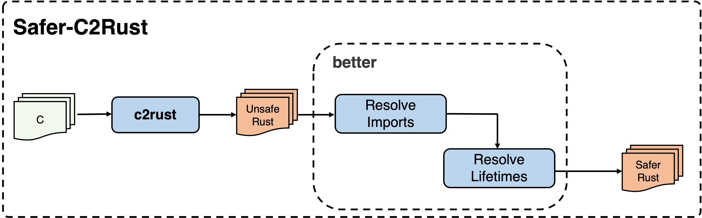

# Safer-C2rust

## 一、介绍

​        本项目将在[c2rust](https://github.com/immunant/c2rust)已有工作的基础之上，实现一个可将不安全的Rust代码转换为更安全的Rust代码的原型系统，该系统可删除重复的类型定义，移除部分不必要的unsafe标记，并将部分裸指针转换为安全引用。

## 二、软件架构



本系统原型由两部分组成：

+ **翻译前端 - c2rust**

  将c2rust作为本系统原型的**翻译前端**，进行C到Rust的翻译；将得到的翻译结果作为**优化工具better**的输入

+ **优化工具 - better**

  对c2rust翻译得到的初始版本的rust代码进行优化，主要分为两部分：**Resolve-Imports**和**Resolve-lifetime**，进行重复类型定义的去除和安全性的提升。

## 三、代码结构及运行流程

+ 代码结构

  ```
  c2rust/
   + c2rust/ -- 使用c2rust v0.16.0版本，作为本项目翻译前端
   + c-code/ -- C测试例
   + better/ -- 优化工具
      + test-inputs/            -- 存放C2Rust翻译得到的初始Rust程序
      + rewrite-invocations/
      + rewrite-workspace/      -- 将test-inputs中的Rust程序复制到此文件下进行优化改写
      + src/                    -- better优化工具功能代码
        + bin/
          + resolve-imports.rs  -- 去除重复类型算法
          + resolve-lifetime.rs -- 安全性提升算法
   + unsafe-fixer --优化工具
   + unsafe-ana   --测试统计工具
  ```

+ 优化流程

  ```
       C Program 
          |
          |  C2Rust（翻译前端）
          V
       Unsafe rust program：重复类型定义 + extern + unsafe 
          |
          |  ResolveImports （优化工具better）
          V
        Unsafe rust program：已去除重复类型定义，消除非必要的extern，使用use引入，消除非必要的unsafe
          |
          |  ResolveLifetimes （优化工具better）
          V
        unsafe rust program: unsafe范围过大
          |
          |  unsafe-fixer （优化工具unsafe-fixer）
          V
        Safer rust program：去除重复类型定义，消除非必要的unsafe，改写部分裸指针
  ```


## 四、安装教程

```shell
# 克隆仓库到本地
$ git clone https://gitee.com/openeuler/c2rust.git

# 在~/your_path/c2rust 目录下检查Rust编译工具链版本
$ rustup toolchain list

# 如果没有nightly-2021-11-22-x86_64-unknown-linux-gnu，下载相应版本
$ rustup toolchain install nightly-2021-11-22

# 下载后切换版本
$ rustup override set nightly-2021-11-22

# 切换成功后再次执行
$ rustup toolchain list
# 应该显示如下信息
  nightly-2021-11-22-x86_64-unknown-linux-gnu (override)

# 为当前2011-11-22版本的Rust编译工具链添加rustc作为库使用
$ rustup component add rustc-dev

```

## 五、使用教程——以json-c为例

### Step1 - 将C代码翻译为Rust代码

#### 1. 输入-工具-输出

+ **输入(C代码)**：`~/your_path/c2rust/c-code/json-c`

+ **工具(c2rust)**： `~/your_path/c2rust/c2rust` 

+ **输出(初始Rust代码)**：`~/your_path/c2rust/better/test-inputs/jsonc_rust`

#### 2. 执行命令

+ **c2rust安装**

> 完整安装教程参考：https://gitee.com/mirrors/C2Rust?_from=gitee_search#installation

```shell
# 前置条件
$ apt install build-essential llvm clang libclang-dev cmake libssl-dev pkg-config python3

# 进入翻译前端-c2rust的目录
$ cd ~/your_path/c2rust/c2rust

# 在~/your_path/c2rust/c2rust/目录下编译
# 编译成功，即安装完毕
$ cargo build --release
```

+ **c2rust翻译**

> 通用翻译方法参考：https://gitee.com/mirrors/C2Rust?_from=gitee_search#translating-c-to-rust

```shell
# 1. 给json-c生成compile_commands.json文件
# 进入json-c测例目录
$ cd ~/your_path/c2rust/c-code/json-c
# 生成compile_commands.json
$ cmake -DCMAKE_EXPORT_COMPILE_COMMANDS=1
$ make

# 2. 使用c2rust进行翻译
# 进入翻译前端-c2rust目录
$ cd ~/your_path/c2rust/c2rust
# 执行翻译命令
$ c2rust transpile your_path/c2rust/c-code/json-c/compile_commands.json\
  -e -o your_path/c2rust/better/test-inputs/jsonc_rust
  
# 3. 验证翻译是否成功(不可以省略，后续优化会使用对应的target目录)
# 进入初始Rust代码存放的目录
$ cd ~/your_path/c2rust/better/test-inputs/jsonc_rust
# 编译(无报错即转换成功)
$ cargo build
```

### Step2 - 执行Resolve-Imports算法

#### 1. 输入-工具-输出

+ **输入(初始Rust代码)**：`~/your_path/c2rust/better/test-inputs/jsonc_rust`
+ **工具(better - resolve-imports)**：`~/your_path/c2rust/better/src/bin/resolve-imports.rs`
+ **输出(去除重复类型后的Rust代码)**：`~/your_path/c2rust/better/rewrite-workspace/jsonc_rust`

#### 2. 执行命令

+ **将初始Rust代码复制到工作区**

```shell
# 进入优化工具better目录下
$ cd ~/your_path/c2rust/better

# 从test-inputs/jsonc_rust 复制到 rewrite-workspace/中
$ cp -r test-inputs/jsonc_rust rewrite-workspace/
```

+ **更改调用参数文件**

`/home/xial/c2rust/better/rewrite-invocations/jsonc_rust`文件中存储关于jsonc_rust的参数信息，分为两部分：

1. jsonc_rust的lib.rs路径
2. jsonc_rust的链接库路径，在对应的target路径中

内容应设置为如下所示，***your_path***是使用者自己的路径前缀：

> /***your_path***/c2rust/better/rewrite-workspace/jsonc_rust/lib.rs
> -L all=/***your_path***/c2rust/better/rewrite-workspace/jsonc_rust/target/debug/deps

+ **执行resolve-imports算法**

```shell
# 进入优化工具better目录下
$ cargo clean
$ cargo run --release --bin resolve-imports -- `cat rewrite-invocations/jsonc_rust`
```

#### 3.算法效果

对比`better/test-inputs/jsonc_rust`和`better/rewrite-workspace/jsonc_rust`

### Step2 - 执行Resolve-LifetimeS算法

#### 1. 输入-工具-输出

+ **输入(初始Rust代码)**：`~/your_path/c2rust/better/rewrite-workspace/jsonc_rust`
+ **工具(better - resolve-imports)**：`~/your_path/c2rust/better/src/bin/resolve-lifetimes.rs`
+ **输出(去除重复类型后的Rust代码)**：`~/your_path/c2rust/better/rewrite-workspace/jsonc_rust`

#### 2. 执行命令

+ **执行resolve-lifetimes算法**

```shell
# 进入优化工具better目录下
$ cargo clean
$ cargo run --release --bin resolve-lifetimes -- `cat rewrite-invocations/jsonc_rust`
```

#### 3. 算法效果

对比`better/test-inputs/jsonc_rust`和`better/rewrite-workspace/jsonc_rust`

### Step3 - 执行unsafe-fixer算法

#### 1. 输入-工具-输出

+ **输入(初始Rust代码)**：`~/your_path/c2rust/better/rewrite-workspace/jsonc_rust`
+ **工具(better - resolve-imports)**：`~/your_path/c2rust/unsafe-fixer`
+ **输出(去除重复类型后的Rust代码)**：`~/your_path/c2rust/better/rewrite-workspace/jsonc_rust`

#### 2. 执行命令

+ **执行unsafe-fixer算法**

```shell
# 进入优化工具unsafe-fixer目录下
$ cargo clean
$ cargo build --release
$ target/release/unsafe-fixer /your_path/c2rust/better/rewrite-workspace/jsonc_rust
```

#### 3. 算法效果

对比`better/test-inputs/jsonc_rust`和`better/rewrite-workspace/jsonc_rust`

