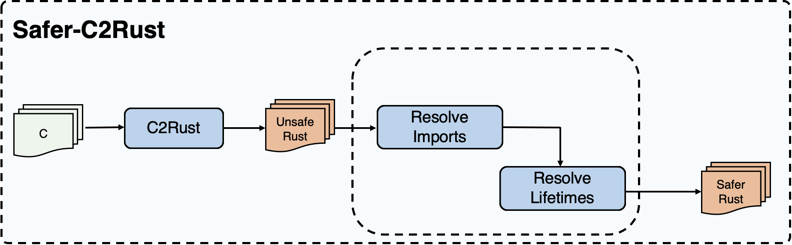

# c2rust

#### 介绍

​        本项目将在c2rust(https://github.com/immunant/c2rust)已有工作的基础之上，实现一个可将不安全的Rust代码转换为更安全的Rust代码的原型系统，该系统可删除重复的类型定义，移除部分不必要的unsafe标记，并将部分裸指针转换为安全引用。

#### 软件架构



​          本系统原型由两部分组成：1.翻译前端;2.优化工具。将c2rust作为本系统原型的**翻译前端**，进行C到Rust的翻译；将得到的翻译结果作为**优化工具better**的输入，在**Resolve-Imports组件**中去除重复类型定义，在**Resolve-lifetime组件**中提升安全性；最终输出更安全Rust代码。

#### 安装教程

```shell
# 克隆仓库到本地
$ git clone https://gitee.com/openeuler/c2rust.git
```

#### 使用说明

+ 环境配置

  ```shell
  # 在~/path-to-c2rust/c2rustmu录下检查Rust编译工具链版本
  $ rustup toolchain list
  # 如果没有nightly-2021-11-22-x86_64-unknown-linux-gnu
  # 进行下载
  $ rustup toolchain install nightly-2021-11-22
  # 下载后切换版本
  $ rustup override set nightly-2021-11-22
  # 下载 rustc 作为库
  $ rustup component add rustc-dev
  ```

+ 文件结构

  ```
  c2rust/
   + better/ -- 优化工具
      + test-inputs/ -- 存放C2Rust翻译得到的初始Rust程序
      + rewrite-invocations/
      + rewrite-workspace/   -- 将test-inputs中的Rust程序复制到此文件下进行优化改写
      + src/
        + bin/
          + resolve-imports.rs -- reslove-imports算法
  ```

+ 执行流程

  ```
  C Program
     |
     |  C2Rust
     V
  Unsafe rust program：重复类型定义 + extern + unsafe
     |
     |  ResolveImports
     V
  Unsafe rust program：已去除重复类型定义，消除非必要的extern，使用use引入，消除非必要的unsafe
     |
     |  ResolveLifetimes (TODO)
     V
  Safer rust program：去除重复类型定义，消除非必要的unsafe，改写部分裸指针
  ```

+ 执行命令

  ```shell
  # 进入优化工具better目录
  $ cd ~/path-to-c2rust/c2rust/better
  # 以下指令均在better目录下执行
  
  # 翻译得到的unsafe的rust代码保存在目录.../test-inputs/，将其复制到工作目录.../rewrite-workspace/
  $ cp -r test-inputs/* rewrite-workspace/
  # 执行reslove-imports
  # json-c测例：
  cargo run --release --bin resolve-imports -- `cat rewrite-invocations/rust_v2021`
  # libxml2测例:
  cargo run --release --bin resolve-imports -- `cat rewrite-invocations/libxml2_rust`
  # curl测例：
  TODO
  
  # 执行reslove-lifetime
  TODO
  ```

#### 参与贡献

1.  Fork 本仓库
2.  新建 Feat_xxx 分支
3.  提交代码
4.  新建 Pull Request


#### 特技

1.  使用 Readme\_XXX.md 来支持不同的语言，例如 Readme\_en.md, Readme\_zh.md
2.  Gitee 官方博客 [blog.gitee.com](https://blog.gitee.com)
3.  你可以 [https://gitee.com/explore](https://gitee.com/explore) 这个地址来了解 Gitee 上的优秀开源项目
4.  [GVP](https://gitee.com/gvp) 全称是 Gitee 最有价值开源项目，是综合评定出的优秀开源项目
5.  Gitee 官方提供的使用手册 [https://gitee.com/help](https://gitee.com/help)
6.  Gitee 封面人物是一档用来展示 Gitee 会员风采的栏目 [https://gitee.com/gitee-stars/](https://gitee.com/gitee-stars/)