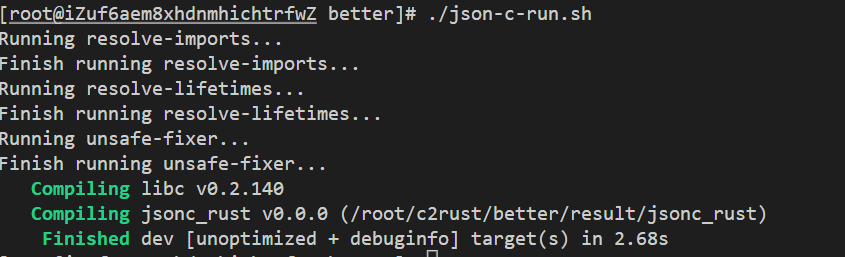

# Safer-C2rust

## 一、介绍

​        本项目将在[c2rust](https://github.com/immunant/c2rust)已有工作的基础之上，实现一个可将不安全的Rust代码转换为更安全的Rust代码的原型系统，该系统可删除重复的类型定义，移除部分不必要的unsafe标记，并将部分裸指针转换为安全引用。

## 二、软件架构


本系统原型由两部分组成：

+ **翻译前端 - c2rust**

  将c2rust作为本系统原型的**翻译前端**，进行C到Rust的翻译；将得到的翻译结果作为**优化工具better**的输入

+ **优化工具 - better**

  对c2rust翻译得到的初始版本的rust代码进行优化，主要分为两部分：**Resolve-Imports**和**Resolve-lifetime**，进行重复类型定义的去除和安全性的提升。

## 三、代码结构及运行流程

+ 代码结构

  ```
  c2rust/
   + c2rust/ -- 使用c2rust v0.16.0版本，作为本项目翻译前端
   + c-code/ -- C测试例
   + better/ -- 优化工具
      + test-inputs/            -- 存放C2Rust翻译得到的初始Rust程序
      + rewrite-invocations/
      + rewrite-workspace/      -- 将test-inputs中的Rust程序复制到此文件下进行优化改写
      + src/                    -- better优化工具功能代码
        + bin/
          + resolve-imports.rs  -- 去除重复类型算法
          + resolve-lifetime.rs -- 安全性提升算法
   + unsafe-fixer --优化工具
   + unsafe-ana   --测试统计工具
  ```

+ 优化流程

  ```
       C Program 
          |
          |  C2Rust（翻译前端）
          V
       Unsafe rust program：重复类型定义 + extern + unsafe 
          |
          |  ResolveImports （优化工具better）
          V
        Unsafe rust program：已去除重复类型定义，消除非必要的extern，使用use引入，消除非必要的unsafe
          |
          |  ResolveLifetimes （优化工具better）
          V
        unsafe rust program: unsafe范围过大
          |
          |  unsafe-fixer （优化工具unsafe-fixer）
          V
        Safer rust program：去除重复类型定义，消除非必要的unsafe，改写部分裸指针
  ```


## 四、安装教程
1. 安装前置依赖
    - openEuler/CentOS
        ```shell
        sudo yum update
        sudo yum install git gcc gcc-c++ llvm llvm-devel clang clang-devel make cmake ninja-build openssl-devel pkgconfig python3
        ```
    - Ubuntu/Debian
        ```shell
        sudo apt-get update
        sudo apt-get install git build-essential llvm clang libclang-dev cmake libssl-dev pkg-config python3
2. 克隆仓库到本地文件夹
    ```shell
    git clone https://gitee.com/openeuler/c2rust.git
    ```
3. 同步git子项目仓库
    ```shell
    cd c2rust
    git submodule init
    git submodule update
    ```

4. 安装`rust`
   ```shell
    curl --proto '=https' --tlsv1.2 -sSf https://sh.rustup.rs | sh
    source $HOME/.cargo/env
    ```
    > 注：如因网络问题失败，可尝试更换国内源
5. 将`rust`工具链切换到`nightly-2021-11-22`版本
    ```shell
    rustup toolchain list
    ```
    如果输出中没有`nightly-2021-11-22-x86_64-unknown-linux-gnu`则执行
    ```shell
    rustup toolchain install nightly-2021-11-22
    rustup override set nightly-2021-11-22
    ```
    执行完成后，再次执行
    ```shell
    rustup toolchain list
    ```
    确认当前`rust`工具链版本为：`nightly-2021-11-22-x86_64-unknown-linux-gnu (override)`
    此时再执行以下命令为当前版本的Rust编译工具链添加rustc作为库使用
    ```shell
    rustup component add rustc-dev
    ```
6. `c2rust`安装
    ```shell
    cd your_path/c2rust/c2rust
    cargo build --release
    ```
    > 完整安装教程参考：https://gitee.com/mirrors/C2Rust?_from=gitee_search#installation
    
     > 速度过慢，或者超时错误，可更换`cargo`国内源
    
## 五、使用教程


### Curl测试

> `curl`项目较大，根据机器配置，运行时间可能较长，快速验证可以先运行测试`json-c`项目

执行以下命令运行测试脚本
```shell
cd your_path/c2rust/better
$ ./curl-rust-run.sh
```

> 优化前的项目文件位于 `test-input`文件夹中，中间结果位于`after-resolve-imports`与`after-resolve-lifetimes`,优化后的最终结果位于`result`文件夹，优化效果使用`c2rust/unsafe-ana`工具进行分析，`libxml2`与`Json-c`同此。


最终编译结果如下：


### libxml2测试

执行以下命令运行测试脚本

```shell
cd your_path/c2rust/better
$ ./libxml2-run.sh
```


最终编译结果如下：


### Json-C测试

执行以下命令运行测试脚本

```shell
cd your_path/c2rust/better
$ ./json-c-run.sh
```


最终编译结果如下：


