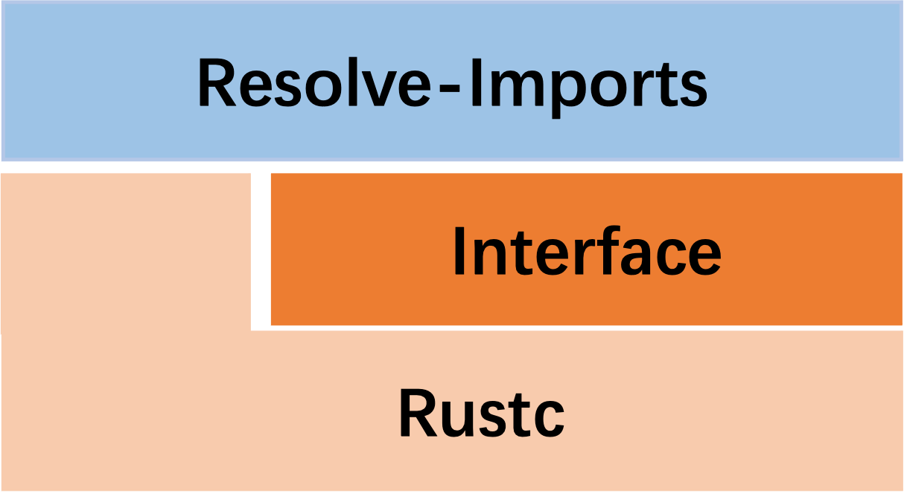
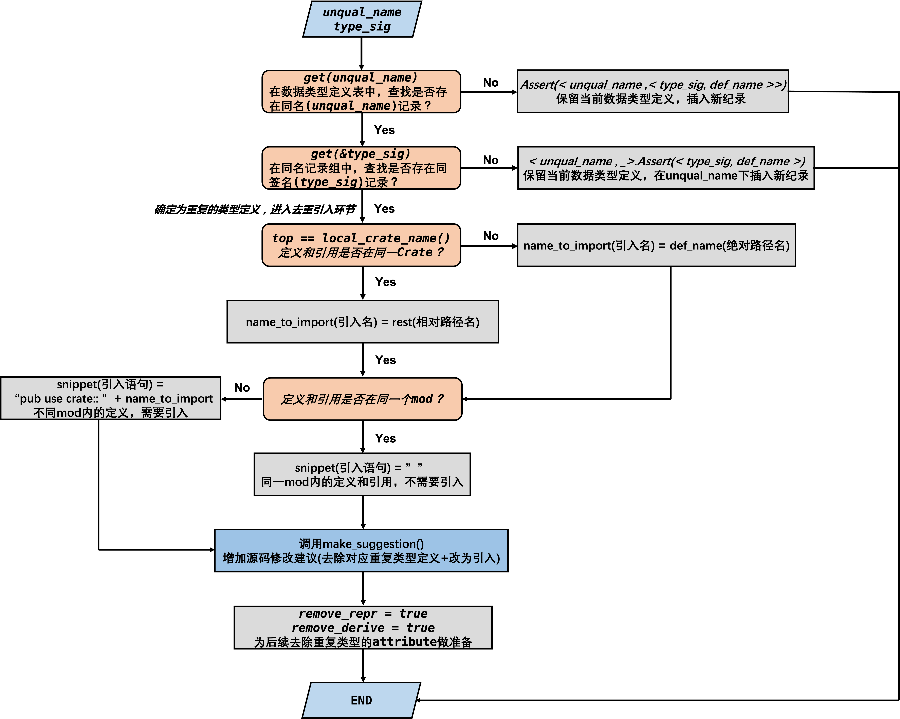

# 一、基本功能

+ 去除重复类型定义
+ 去除非必要的函数`unsafe`标记(不做代码修改的请款下)
+ 去除非必要的`extern`引入

# 二、基本思想

​		使用静态分析工具`Lint`，扫描待优化的Rust代码的`HIR (High-Level Intermediate Representation)`。对于每个类型定义只保留一次，重复的类型定义使用`use`引入；在不修改函数的情况下，去掉非必要的`unsafe`标记(原代码中函数100%为`unsafe`)；对于翻译后，有完整Rust定义的函数，不采用`extern`引入，改用`use`将其引入使用。

> 使用`rustc_lint`提供的接口，编写相关`LintPass`，采用`LateLintPass`
>
> https://doc.rust-lang.org/stable/nightly-rustc/rustc_lint/trait.LateLintPass.html



# 三、代码详解

## (一) 去除重复类型

流程：保留 ==> 去重 ==> 引入 ==> 重构

### 1.重复类型判定 - fn duplicate_struct()

+ **所需数据结构：**

```rust
// 1. 数据类型名
unqual_name:&str
  
// 2. 数据类型签名
type_sig: TypeSig
enum TypeSig {
    /// An unknown type (coming from type definitions)
    Unknown,
    /// A struct with field names.
    Struct(Vec<String>),
    /// A C union with field names
    Union(Vec<String>),
}

// 3. 数据类型定义位置
def_name: &String

// 4. 去重HashMap: <类型名 , <签名 , 定义位置> >
type_defs: HashMap<String, HashMap<TypeSig, String>>
```

以定义在`json-c/src/json_object.rs`中的`struct json_object`为例：

```rust
pub struct json_object {
    pub o_type: json_type,
    pub _ref_count: uint32_t,
    pub _to_json_string: Option::<json_object_to_json_string_fn>,
    pub _pb: *mut printbuf,
    pub _user_delete: Option::<json_object_delete_fn>,
    pub _userdata: *mut libc::c_void,
}
```

***unqual_name*** : `json_object`

***type_sig*** : `< o_type, _ref_count, _to_json_string, _pb, _user_delete, _userdata >`

***def_name*** : `src::json_object::json_object`


+ **函数流程图**




TODO

```rust
fn is_safe_fn(&self, ctx: &LateContext, fn_name: &Name) -> bool {
        self.call_graph
            .unsafe_behavior() // HashMap<Name, BTreeSet<UnsafeBehavior>>
            .get(fn_name)
            .map_or(true, |s| s.is_empty())
            && !self.calls_c_fns_we_handle(ctx, fn_name)
    }
```

