# Resolve-lifetimes设计文档

# 1 基本功能

将部分Lifetime类的裸指针转换为安全引用或者进行所有权的转移，从而去除非必要的unsafe标记，提升整个程序的安全性。

# 2 背景知识
## **2.1 裸指针分类**

+ **VoidPtr** —— 从void*转换或转换到void*的裸指针

+ **ExternPtr** —— 作为参数传递给外部函数调用，或者外部函数调用后返回的裸指针

+ **PtrArith** —— 用于指针算术(位移等)的裸指针   

+ **Lifetime** —— 不属于上面三类的裸指针，主要表现为：

1. 在程序内实现的API签名中裸指针，比如：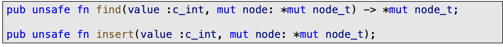

2. 自定义内存分配(malloc等)得到的裸指针，比如： 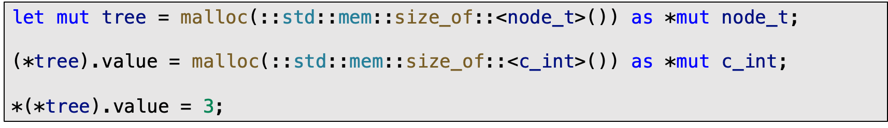

  

##  2.2 为什么选择lifetime类裸指针

+ 经过调研，我们发现裸指针的声明和裸指针的解引用中，**lifetime类占比最高**；

+ 其他类别的裸指针重写为安全引用需要解析所有权和生命周期信息，先处理lifetime类裸指针有助于我们积累相关经验；

+ 对lifetime类裸指针进行重写，除了改变指针声明和添加生命周期信息外，不涉及太多的侵入性代码添加；

 

# 3 基本思想

***借助编译器***：通过Rust的借用检查器(Borrow Checker)获取生命周期、借用和可变性的相关信息；

***Borrowed => Owned => Raw***：先做乐观假设，将所有lifetime类裸指针声明改写为借用(Borrowed)，再进行迭代，将其中部分根据编译器检查结果转换为所有权的转移(Owned)，又或者退回原本的裸指针声明(Raw)；

***最小生命周期约束***：Rust规定在函数签名或者数据类型定义中声明引用时，必须提供其生命周期信息。因此，在将裸指针声明改为引用时，我们先提供最小的生命周期约束，在迭代过程中，通过和编译器的交互不断添加新的约束条件；

***终止保证***：对于不能提升安全性的裸指针，算法会根据实际情况，回退到原本的裸指针声明，保证可以通过编译器检查，从而保证该算法会终止；

# 4 详细设计

## 4.1 算法描述

 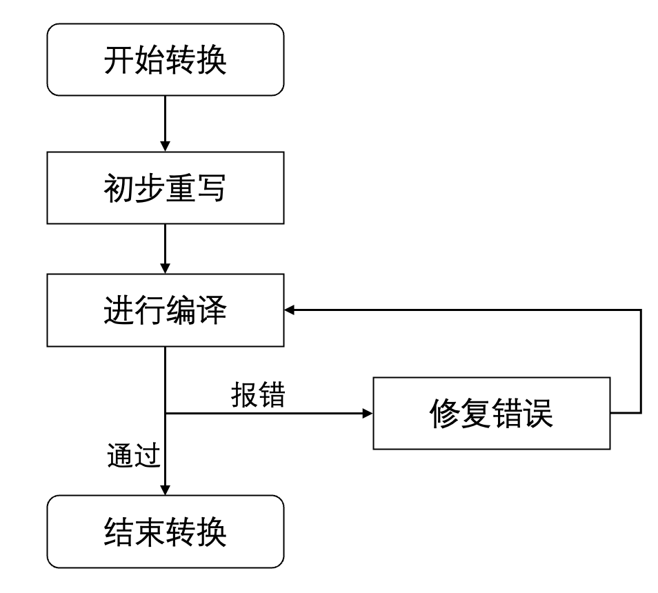

**Resolve-lifetimes流程图**

大体上，转换步骤分三步：

1. 将翻译得到的rust程序，进行初步重写为具有***乐观假设***的rust程序；
2. 进行编译，程序报错时：使用编译器作为预言机来查找借用检查违规、通过约束程序来修复生命周期错误；
3. 迭代过程2，直到通过编译；

### 4**.1.1** 初步重写

初步重写的总体思想是：**1）假设所有的裸指针声明都是借用的**；**2）提供最小的生命周期约束**。

当在函数签名或数据类型定义中声明引用时，我们必须提供它的生命周期信息。这些信息包括引用本身的生命周期，还包括本身由生命周期参数化的任何被引用类型的信息。我们这一阶段的目标是生成对各个引用约束最小的生命周期信息，以便从最乐观的生命周期假设开始。

初步重写分三步：

1. ***重写数据结构内部字段中的裸指针***

对于每个裸指针数据结构内部字段，我们根据其类型提供生命周期，为每个类型使用不同的生命周期变量。

我们还填充生命周期类型参数，对相同类型的所有实例使用相同的生命周期变量。

  比如：在node_t结构体中

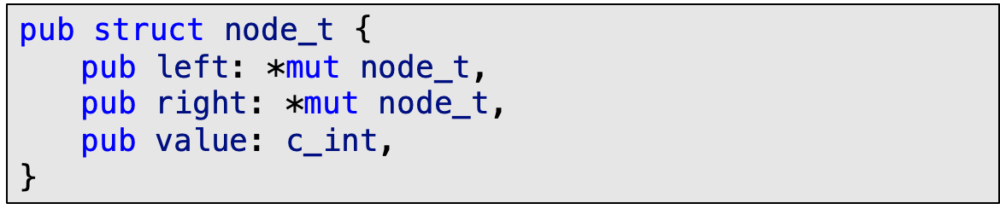

  初步改写后(为每个类型提供不同的生命周期参数)

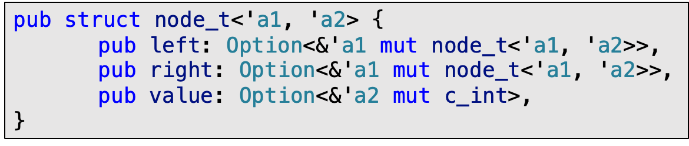

可变的借用是不可复制或克隆的，因此我们从受影响的数据结构中删除#[derive(Copy,Clone)]注释。

我们提出了一种通用算法来为递归定义的结构体生成生命周期，对生成的生命周期有以下限制：

+ 定义中相同类型的所有字段共享相同的生命周期变量。

+ 定义中同一结构的所有实例共享相同的生命周期参数。 例如，在node_t的定义中，左子树和右子树的node_t的两个实例都使用相同的生命周期参数'a1和'a2。

+ 嵌套指针中的所有引用都被分配了相同的生命周期。例如，*const *const T 转换为Option<&'a Option<&'a T>>。

  算法第一步是构建程序中所有结构体的指向图，并用字段标记边。在我们的算法中，一旦我们计算出强连通分量（SCC），每个SCC对应一组相互递归的结构定义。在构建SCC指向图之后，我们从原始图中聚合标签，并为每个标签添加源节点。对于每个结构体定义，我们收集从该结构的SCC可到达的所有边上的生命周期名称，以确定其生命周期参数。将结构体***S***的字段***f***重写为引用时，我们使用从包含标签***S.f***的边分配的生命周期名称。

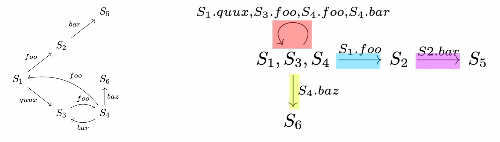 

当在堆上分配一个结构时（即，当我们重写malloc调用时），Rust需要用默认值初始化它，以防止从未初始化的内存中读取。我们重写的结构中的所有字段（而不是它们指向的数据）都属于以下类别之一：裸指针、可选引用、原始类型或其他结构。我们为所有结构实现了Default特性，并且为选项和原始类型实现了Default特性，因此我们使用Default::default为这些类型的字段生成默认值。我们用空指针初始化结构内的所有裸指针（即所有未转换为安全引用的字段）。

在以下情况下，我们不会重写结构的定义：

+ 结构包含在（直接或通过指针）作为外部API一部分的类型中。在这种情况下，我们无法获得生命周期保证，因为外部 API 可能持有对值的引用、保留其副本或负责其分配/释放分配。

+ 结构包含一个Union。在这种情况下，我们无法为结构生成默认值，因为Union没有任何明确定义的默认值。可以选择选择其中一个变体并为该字段生成默认值。

2. ***重写函数签名中的裸指针***

在确定结构字段中的生命周期后，我们重写函数签名。对于函数签名中的每个参数，如果该参数没有被尚未处理的裸指针影响，我们首先将其转换为引用。 对于函数签名，我们为每个参数使用单独的生命周期，以使函数签名尽可能通用编译器检查。

  比如：

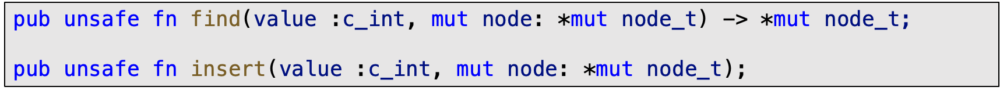

  初步改写后：

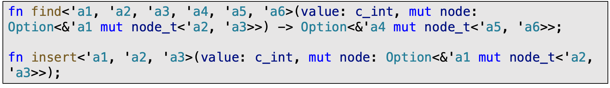

3. ***重写函数体中的裸指针***

  函数体的重写包括四种：

+ **重写malloc**：将仅分配单个对象（相对于数组）的malloc调⽤重写为对Box::new的调⽤

+ **删除多余的free**：假如指针可以⽤安全引⽤替换掉，删除对free的调⽤

+ **引用对象相等->引用本身相等**：将引⽤的相等性⽐较（Rust中默认是检查引⽤对象的相等性）重写为对引⽤本⾝的相等性⽐较（即检查两个引⽤是否指代同⼀个对象）。这种改写保留了原程序的预期语义（即两个指针是否相等的判断语义）

+ **重写解引⽤**：对于不可变引⽤，克隆它，这样原始对象就不会被破坏；对于可变引⽤，根据上下⽂进⾏可变或不可变借⽤;

  为了帮助重新借用可变引用，我们使用了图14中定义的辅助函数borrow和borrow_mut。其中'a是原始对象的生命周期，'b是借用对象的生命周期。

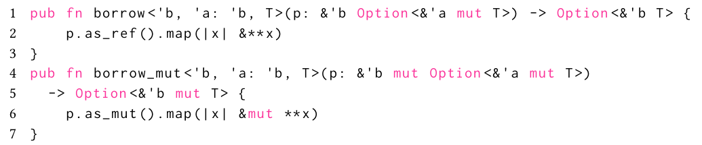

如果一直指针P。可以转变为可变引用，我们就进行以下重写:

+ 如果p被传递给一个可变的上下文(一个需要&mut T的上下文)，我们将p重写为borrow_mut(p)。

+ 如果p被传递给一个不可变的上下文(一个需要&T的上下文)，我们将p重写为borrow(p)。

+ 如果p被解引用，我们就把*p重写为**p.as_mut().unwrap()获得一个可变引用并立即解引用。如果它在不可变的上下文中被解引用，我们使用as_ref而不是as_mut。注意，unwrap、as_mut和as_ref都来自Rust标准库。

  我们将空指针重写为None，即不包含任何内容的Option值。我们同样将空指针检查p.is_null()重写为p.is_none()。

  比如： 

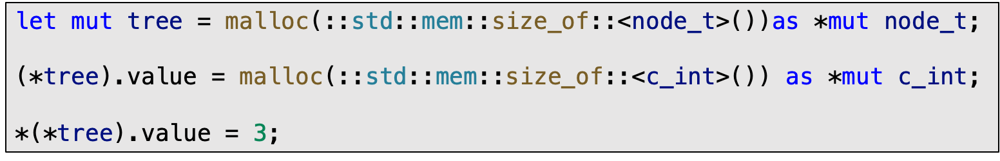

  改写后(重写malloc)

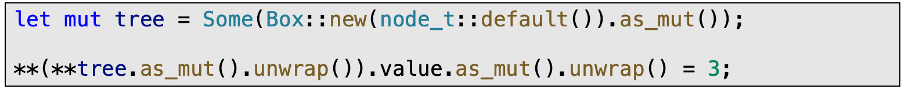  

### 4**.1.2** 根据报错信息反复修改程序，直到编译通过

  经过初步重写的Rust程序，可能无法通过Rustc的编译(因为初步重写是最乐观的假设，全部从裸指针升级为引用了)。所以，resolve-lifetime的最后一个阶段就是反复使用Rustc对初步改写后的程序进行编译，根据编译器提供的报错信息，对初步重写后的程序，进行有选择的迭代改写，直到最终得到可以通过编译的程序，完成resolve-lifetime算法的整个改写流程。

迭代改写过程中大致有两种改写可能：

1. 为通过编译器的检查，为一些引用提供更多的生命周期信息，或者改变引用类型；
2. 从初步改写后的引用，回退到原本不安全的裸指针(部分改写失败)；

迭代过程中，对于编译器的报错信息我们会做如下追踪：

+ **生命周期约束**  比如当编译下图中初步重写后的Rust程序时，编译器报错信息中对于函数find有一个额外的约束 ' a1 : 'a2，即：' a1需要比' a2活得长，因为第20行有return语句。根据这个报错信息，在下一次迭代中，我们需要改写程序来添加这个约束。  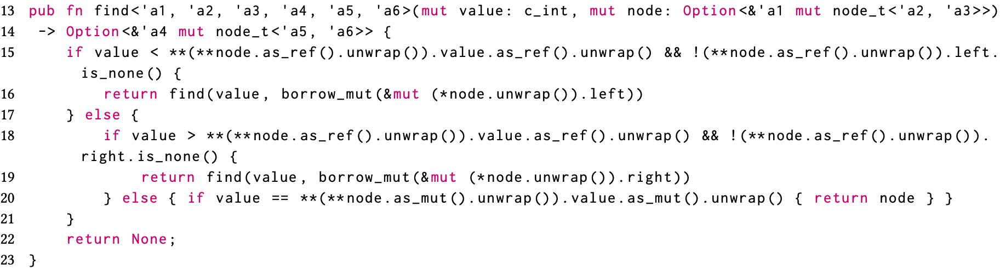

+ **引用的存活时间比对象长**  如果原始对象在堆上，我们将原本对其的引用提升为所有权的转移(move操作)，即从Option<&T >转换为< Option >；如果原始对象在栈上，那么我们将这些引用降级为裸指针。

+ **malloc和free相关** 涉及到重写malloc和free相关的错误，在随后的迭代中，我们不会尝试将来自这些特定malloc调用的返回值重写到这些特定的free调用中。

+ **Uaf(释放后使用)和多个可变借用同时存在** 我们将这些引用重写回裸指针。

  当我们将一个引用降级为裸指针时，我们需要将所有和它发生交互的引用也降级为裸指针，我们使用***污点分析***来传播所需的关于引用的信息。类似地，如果我们决定讲一个引用改为所有权的转移(move操作)，那么根据污点分析，流入它的所有值也必须被拥有。

## 4.2 污点分析

TODO

 

# 5 主要代码解析

TODO